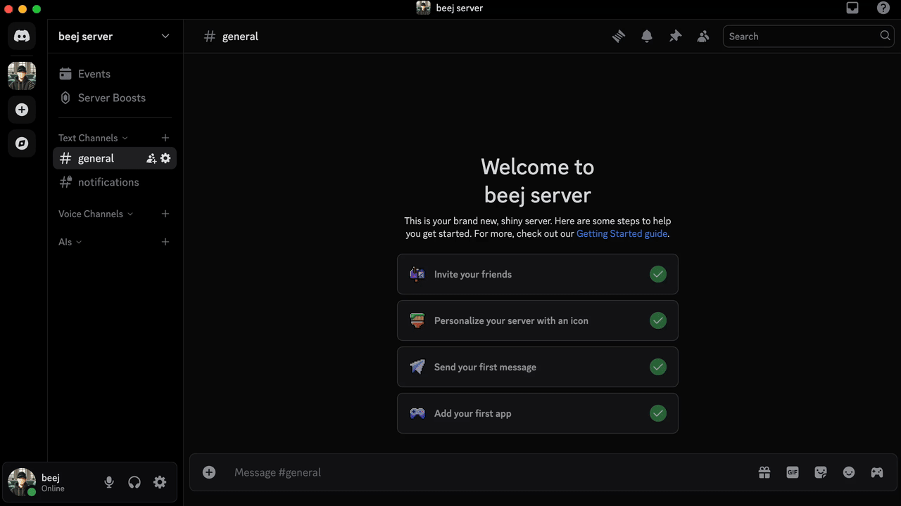

# Add an AI Agent to your Discord Server with Agent Development Kit

AI Agents are having a moment - for one simple reason: they are the future. We’ve seen the hype around AI chatbots and image generators but the next real evolution is happening with systems that can think, remember, and take action. The need to embed intelligent, stateful AI into real world applications is becoming essential and new tools are making it easier than ever.

This is where Google's **Agent Development Kit (ADK)** comes in. ADK abstracts away the complexity of managing LLM interactions, enabling developers to build AI agents that maintain context, use tools, and hold rich, multi-turn conversations.

In this post, we will do a deep dive on how to build a Discord bot that connects to an ADK agent, making it easy to interact with it directly through Discord.




## What is ADK?

Let's start with the **A** in ADK first: *agents*. [AI agents](https://cloud.google.com/discover/what-are-ai-agents) are software systems that use AI to pursue goals and complete tasks on behalf of users. They show reasoning, planning, and memory and have a level of autonomy to make decisions, learn, and adapt.

An agent isn’t just a chatbot; it’s a goal driven system that can think, remember, and take actions when needed.

**Agent Development Kit (ADK)** makes it easier to build these systems. It wraps a *large language model* with *tools*, *memory*, and *instructions* that guide how the agent behaves. It also provides a framework for building and managing multiple agents that work together with minimal boilerplate.

### Defining an Agent

Creating an ADK Agent involves defining a few key attributes:

- **Name** – A unique identifier for the agent
- **Model** – The specific large language model you want to use (`gemini-2.5-pro`, `gemini-2.0-flash`, `openai/gemma-3:12b`, etc.)
- **Description** – A brief summary telling agent what it does
- **Instructions** – A detailed prompt that guides the agent’s behavior
- **Tools** – Functions the agent can call when it needs extra capability (e.g., web search, file access, or custom logic)

Our Agent definition will look something like this:

```python
adk_agent = Agent(
    model='gemini-2.0-flash',
    name='discord_agent',
    description='A helpful assistant for user questions in Discord channels.',
    instruction='Your name is {channel_name}. You are talking with a person named {user}. Answer user questions to the best of your knowledge and engage in helpful conversation.',
    tools=[google_search]
)
```

Once defined, ADK handles the heavy lifting: context tracking, reasoning, and tool invocation. If you want to explore more advanced examples, check out some [sample ADK agents](https://github.com/google/adk-samples/tree/main/python). For now, this simple setup is all we need to power the brains of our Discord bot.

### Sessions: Giving the Agent Memory

To hold multi-turn conversations and respond to more than just a single prompt, an agent needs memory. That is where *Sessions* come in.

[Sessions](https://google.github.io/adk-docs/sessions/) are containers that store the history of a conversation, including user messages, agent responses, tool calls, and internal state. 


*Sessions are conceptually similar to a conversation thread between the user and the agent.*

Sessions are managed by a *SessionService*, which determines where and how session data is stored. ADK offers [three types of SessionServices]((https://google.github.io/adk-docs/sessions/session/#sessionservice-implementations)):
- `InMemorySessionService` - Easiest to use, but data is lost when we shut down our bot
- `DatabaseSessionService` - Use your own custom storage backend
- `VertexAiSessionService` - Hosted in GCP VertexAI

For this demo, we will use `InMemorySessionService`. Just note that it won't retain memory after the bot is shutdown. For production ready use-cases you would want to implement VertexAI or a database for persistent Session storage.


### Runners: Powering the Conversation Loop

Now that we’ve got an agent and a session, we need a way to tie everything together. That’s the job of the *runner*.

The [runner](https://google.github.io/adk-docs/runtime/#runners-role-orchestrator) is the master orchestrator. It handles:

1. Storing the user’s message in the session history
1. Kicks off the agent, passing it the current session context
1. Waits for an event — a response, tool call, or update — generated by the agent
1. Processes the event, updating memory, saving state, or storing generated artifacts
1. Yields the event back to your app (like sending it to a UI or chat window)
1. Signals the agent to continue, and repeats until the interaction is complete


*Source: [ADK Documentation](https://google.github.io/adk-docs/runtime/#core-idea-the-event-loop)*

Here’s what defining the runner looks like in practice:

```python
runner = Runner(
    agent=adk_agent,
    app_name="DiscordBot",
    session_service=session_service_stateful, # previously initialized SessionService
)

new_message = types.Content(role="user", parts=[types.Part(text="Hello AI Agent!")])

# Execute the runner to produce a list of *events*
while runner.run(user_id=user_id, session_id=adk_session_id, new_message=new_message): 
    print(event.content.parts[0].text, end="") # stream the response to console
```

Runners do a lot of work! But the primary takeaway is that runners manage the interactions between our user and our agent, ensuring both sides can comunicate with another with the appropriate context.

### Tools: Extending What Agents Can Do
One last powerful aspect of ADK that our Agent will use is `tools`. Tools allow agents to interact with the outside world. This could be as simple as calling external systems to gather information, or as complex as triggering real-world actions. ADK allows for both custom and built-in tools.

When we initialized our agent we only gave it access to one tool: `google_search`. This allows it to perform Google searches based on the user's input.

```python
adk_agent = Agent(
    model='gemini-2.0-flash',
    name='discord_agent',
    # ...
    tools=[google_search]
)
```

But this is just scratching the surface. Tools are a major part of what makes agents useful, so I encourage you to check out more [tools](https://google.github.io/adk-docs/tools/built-in-tools/#available-built-in-tools) to expand the functionality of your agents.

## Discord Work

Before we can connect our agent to Discord, we need to create a Discord bot and get an authentication token. This will allow our code to take actions as our Agent.

1. **Create a Discord Application**
- Go to the [Discord Developer Portal](https://discord.com/developers/applications).
- Click *New Application*, give it a name, and hit *Create*.

2. **Get Your Bot Token**
- In the menu, select the *Bot* page. Under *Token* click *Reset Token* and confirm.
- Copy the generated token value and store it securely. You’ll need to add it to your environment variables as `DISCORD_TOKEN`.

3. **Enable Privileged Intents**

- Still on the *Bot* page, scroll down to *Privileged Gateway Intents* and turn on `MESSAGE CONTENT INTENT`. This allows the bot to read the content of messages in channels.

4. **Add the Bot to Your Server** 

- To add the bot to your Discord server, you’ll need to generate an OAuth2 invite link. Go to the *OAuth2* tab in the left sidebar.
  - Under *Scopes*, check `bot`
  - Under *Bot Permissions*, check at least:
    - `Send Messages`
    - `Read Message History`
    - `Manage Channels`
  - Copy the generated URL at the bottom, open it in your browser, and select your Discord server.

Once added, your bot should appear as a member of your Discord server. It will appear online once we launch the python script.

## How will users interact with the bot?

Let’s walk through the user experience. This bot supports two main commands:

*   **`!sidebar`:**  Creates a new text channel and starts a fresh session with the AI Agent. Each channel acts as a dedicated space for a specific conversation. When the channel is created, a new session is initialized with no prior context history.

*   **`!exit`:** Provides a clean way to end conversations within these dynamically created channels. Upon running this command within a conversation, we will delete the Discord channel, ending the session.

### The Flow

Users interact with the bot by running `!sidebar` in any regular channel. This spins up a new thread (Discord text channel) and links it to a fresh ADK session. Inside that channel, users can message the bot directly. Thanks to the `google_search` tool, the bot can pull in real-time web information as needed.

Once the conversation is finished, the user can type `!exit`, which tells the bot to delete the channel and clean up the associated session state.

## Pulling it all together in Code

Let’s look at how all of this comes together in code. Some snippets are below, the full code can be found in [Github](https://github.com/bjbloemker-google/discord-adk-agent).

### 1. Initialization

When the bot starts, we initialize the key components it needs: Discord authentication setup, a data structure to track created channels, and our ADK Agent & SessionService.

```python
DISCORD_TOKEN = os.getenv("DISCORD_TOKEN")
intents = discord.Intents.default()
intents.message_content = True
bot = commands.Bot(command_prefix='!', intents=intents)

created_channels = {}
channel_lock = asyncio.Lock()

# ...

adk_agent = Agent(
    model='gemini-2.0-flash',
    name='discord_agent',
    description='A helpful assistant for user questions in Discord channels.',
    instruction='Your name is {channel_name}. You are talking with a person named {user}. Answer user questions to the best of your knowledge and engage in helpful conversation.',
    tools=[google_search]
)
session_service_stateful = InMemorySessionService()
```

- **Discord Information:**
  - the `DISCORD_TOKEN` authenticates our bot to Discord
  - `intents` describes the Discord permissions we will require 
  - `bot` is our python object that we will use to interact with Discord
- **Channel Information:**
  - `created_channels` maps channel IDs to their corresponding ADK sessions
  - `channel_lock` ensures no race conditions when accessing shared data
- **ADK Agent Setup:**
  - `adk_agent` defines the behavior of our bot, as discussed above
  - `session_service_stateful` stores session state in memory (not persisted when the script terminates)

### 2. Handling Discord Events

Discord bots are event-driven. Here are the core events and commands we rely on:

- **`@bot.event() on_ready()`**: Triggers when application starts and connects to Discord. We just send a debug notification to the console on start to let us know its online
- **`@bot.event() on_message(message)`**: Triggered on every message the bot can read
- **`@bot.command() sidebar(ctx)`**: Triggers when someone types `!sidebar`
- **`@bot.command() exit(ctx)`**: Triggers when someone types `!exit`

These events are global, meaning that within our application code we will need to make sure that we are talking in the right Discord server and channel.

#### Handling Events: The `!sidebar` Command

The `!sidebar` command initializes a new conversation (Session) with our AI Agent. It needs to create a new Discord channel for the conversation to occur, instantiate the Session associated with our ADK agent, and record that information for the future.

```python
@bot.command()
async def sidebar(ctx):
    # [Code to create a new Discord channel on our server with a random name (i.e. "curious-alex")]
    # ...
    message = await ctx.send(f'Sidebar created in <#{channel.id}>')
    
    # Create a new ADK session for the Discord channel
    user_id = str(ctx.author.id) # Use Discord user ID as ADK user ID
    session_id = str(uuid.uuid4()) # Generate a unique session ID for ADK

    initial_state = {
        "user": ctx.author.display_name,
        "channel_name": channel.name,
        "user_preferences": "The user is interacting via Discord.",
    }

    adk_session = await session_service_stateful.create_session(
        app_name="DiscordBot", # A consistent app name for all sessions
        user_id=user_id,
        session_id=session_id,
        state=initial_state,
    )

    async with channel_lock:
        if guild.id not in created_channels:
            created_channels[guild.id] = {}
        created_channels[guild.id][channel.id] = {
            'original_channel_id': ctx.channel.id,
            'message_id': message.id,
            'sender_message_id': ctx.message.id,
            'adk_session_id': adk_session.id # Store the ADK session ID here
        }
```
- We create a Session associated with the user that submitted the request. This is stored within our SessionService.
  - We can also initialize the state of our agent, which allows us to pass some key information to the Agent that is unique to this session such as the `channel_name` and the `user` that the agent is talking to.
- After creating our Session, We store everything in `created_channels` so we can refer to it later.

#### Handling Events: `on_message()`

The `on_message()` event handler processes all incoming messages from any channel the bot can see. This allows us to detect user responses in a specific channel and trigger a prompt reply from the ADK agent.

```python
@bot.event
async def on_message(message):
    # [Code to ignore messages from bots and the !exit command]
    # ...

    # Process the message if it is in an AI channel
    # guild == server is Discord vocabulary
    if guild_id in created_channels and channel_id in created_channels[guild_id] and 'adk_session_id' in created_channels[guild.id][channel_id]:
        adk_session_id = created_channels[guild_id][channel_id]['adk_session_id']
        user_id = str(message.author.id)

        runner = Runner(
            agent=adk_agent,
            app_name="DiscordBot",
            session_service=session_service_stateful,
        )

        new_message = types.Content(
            role="user", parts=[types.Part(text=message.content)]
        )

        try:
            response_text = ""
            async with message.channel.typing(): # Show typing indicator
                for event in runner.run(user_id=user_id, session_id=adk_session_id, new_message=new_message):
                    if event.is_final_response():
                        if event.content and event.content.parts:
                            response_text = event.content.parts[0].text
                            break # Exit loop after getting final response

            if response_text:
                await message.channel.send(response_text)
        except Exception as e:
            print(f"Error running ADK Agent: {e}")
            await message.channel.send("An error occurred while processing your request.")

    # Allow other commands to be processed
    await bot.process_commands(message)
```
After ignoring messages from other bots, the function checks if a message is in a designated AI channel. If so, it sends the content to an AI agent and relays the response. Otherwise, the message is processed for standard commands (e.t., !sidebar, !exit) via the bot.process_commands(message) call.

#### Handling Events: The `!exit` Command

The `!exit` command is responsible for cleanup. It's job is to delete the created channel once the conversation has ended. It is only allowed to delete channels within the category (Discord conversation group) we have been using to place our created channels in ("AIs").

```python
@bot.command()
async def exit(ctx):
    channel = ctx.channel
    guild = ctx.guild
    if channel.category and channel.category.name == 'AIs':
        # ...
        await channel.delete()
    else:
        await ctx.send("This command can only be used in a channel under the 'AIs' category.", delete_after=10)

```

## That's it!

With all the pieces in place, we should have a working Discord bot that responds using our ADK Agent :)


While there’s plenty of room to scale this up with more robust security and infrastructure, this demo shows just how easy it is to integrate AI Agents into real applications using Agent Development Kit. What was built here is a small slice of what’s possible. 

ADK fills a key gap in LLM integration: managing multi-turn conversations with memory, state, and external tool access. This is particularly relevant as LLMs move beyond simple question-answering to more sophisticated, task-oriented interactions. 

With frameworks like ADK now available, I anticipate developers will move quickly to integrate AI into every aspect of existing applications. Until then though, I’ll be managing my personal Agent Army through Discord 🫡